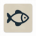

<h1>
  
  Fish Aquarium App
</h1>

Учебное приложение для изучения основных компонентов UI/UX в Android-разработке.
В процессе разработки я освоил использование **ViewPager2** и **TabLayout** для создания слайдов с плавной навигацией между страницами, научился загружать изображения из сети с автоматическим кэшированием через библиотеку **Picasso**, а также создавать адаптивные карточки (**CardView**) с детальным описанием, используя **ConstraintLayout** для точной вёрстки. Дополнительно я реализовал динамическую привязку данных к интерфейсу через **RecyclerView.Adapter** и настроил отступы под системные элементы (например, нижнюю панель), чтобы обеспечить корректное отображение на всех устройствах.

## Описание
Приложение отображает три вида рыб.
Каждая рыба представлена на отдельной странице с:
- Изображением, загруженным из интернета через Picasso.
- Названием вида.
- Подробным описанием.

Возможности:
- Листание страниц с анимацией (ViewPager2).
- Переход к нужной рыбе через вкладки (TabLayout).
- Адаптивная вёрстка с использованием CardView.

## Технологии и библиотеки
- **CardView** — для создания карточек с закругленными углами и тенью.
- **ViewPager2** — для горизонтальной навигации между страницами.
- **TabLayout** — для отображения вкладок с названиями рыб.
- **Picasso** — для загрузки и кэширования изображений из сети.
- **RecyclerView** — в связке с ViewPager2 для эффективного отображения данных.

